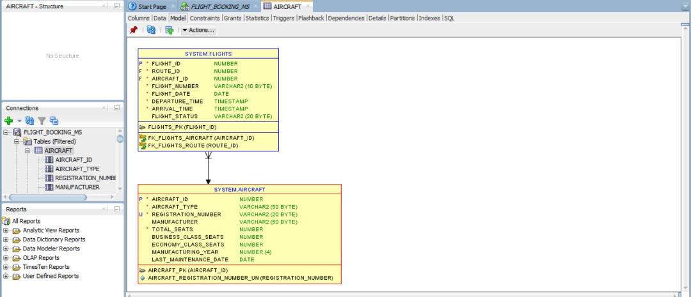
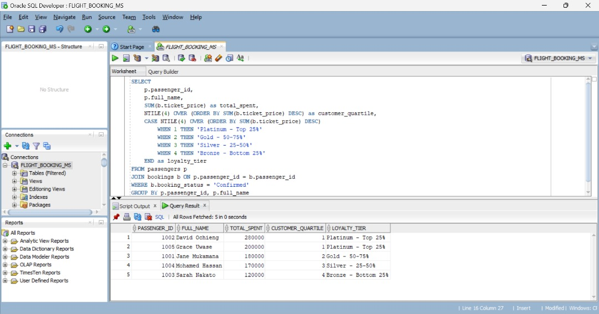

# ✈️ Airline Window Functions Assignment

👤 **Author:** Murihira Muhire Arsene  
      **ID:**   27656
      
📚 IT in Software Engineering  
📝 **Course:** Database Development with PL/SQL (INSY 8311)  
📅 **Date:** 29 September 2025  

---

## 📘 Introduction
This project demonstrates how **SQL window functions** can uncover insights in airline operations.
By analyzing passengers, flights, and bookings, we answer questions like:
- Which routes generate the most revenue in each region?
- Who are the top-spending passengers?
- How do ticket prices change over time?

---

## 🏗️ Database Schema
Five related tables power the analysis:

| Table | Key Columns | Purpose |
|------|-------------|--------|
| **passengers** | passenger_id, full_name, email | Passenger details |
| **aircraft** | aircraft_id, aircraft_type, total_seats | Fleet information |
| **routes** | route_id, origin_city, destination_city, region | Flight routes & pricing |
| **flights** | flight_id, route_id, aircraft_id, flight_date | Scheduled flights |
| **bookings** | booking_id, passenger_id, flight_id, ticket_price | Reservations & revenue |

---

## Model



## 📥 Full SQL Script
Below is the complete SQL script used in this project, including table creation, sample data insertion, and all queries.

```sql
CREATE TABLE passengers (
    passenger_id NUMBER PRIMARY KEY,
    full_name VARCHAR2(100) NOT NULL,
    email VARCHAR2(100) UNIQUE NOT NULL,
    phone VARCHAR2(20),
    nationality VARCHAR2(50),
    date_of_birth DATE,
    registration_date DATE DEFAULT SYSDATE
);
```
   


 
  ```sql

INSERT INTO passengers VALUES (1001, 'Jane Mukamana', 'jane.m@email.com', '+250788123456', 'Rwanda', DATE '1985-03-15', DATE '2023-01-10');
INSERT INTO passengers VALUES (1002, 'David Ochieng', 'david.o@email.com', '+254722334455', 'Kenya', DATE '1990-07-22', DATE '2023-02-15');
INSERT INTO passengers VALUES (1003, 'Sarah Nakato', 'sarah.n@email.com', '+256777889900', 'Uganda', DATE '1988-11-30', DATE '2023-03-20');
INSERT INTO passengers VALUES (1004, 'Mohamed Hassan', 'mohamed.h@email.com', '+255655112233', 'Tanzania', DATE '1982-05-18', DATE '2023-04-05');
INSERT INTO passengers VALUES (1005, 'Grace Uwase', 'grace.u@email.com', '+250788234567', 'Rwanda', DATE '1995-09-12', DATE '2023-05-10');
COMMIT;

```
   

  
```sql 

CREATE TABLE aircraft (
    aircraft_id NUMBER PRIMARY KEY,
    aircraft_type VARCHAR2(50) NOT NULL,
    registration_number VARCHAR2(20) UNIQUE NOT NULL,
    manufacturer VARCHAR2(50),
    total_seats NUMBER NOT NULL,
    business_class_seats NUMBER,
    economy_class_seats NUMBER,
    manufacturing_year NUMBER(4),
    last_maintenance_date DATE
);

```

    


```sql


INSERT INTO aircraft VALUES (5001, 'Boeing 737-800', '9XR-WA', 'Boeing', 180, 20, 160, 2018, DATE '2024-08-15');
INSERT INTO aircraft VALUES (5002, 'Airbus A320', '9XR-WB', 'Airbus', 150, 16, 134, 2019, DATE '2024-09-01');
INSERT INTO aircraft VALUES (5003, 'Boeing 787 Dreamliner', '9XR-WC', 'Boeing', 250, 30, 220, 2020, DATE '2024-08-20');
INSERT INTO aircraft VALUES (5004, 'Embraer E190', '9XR-WD', 'Embraer', 100, 12, 88, 2017, DATE '2024-09-10');
INSERT INTO aircraft VALUES (5005, 'Airbus A330', '9XR-WE', 'Airbus', 300, 40, 260, 2021, DATE '2024-09-05');
COMMIT;

```


```sql
CREATE TABLE routes (
    route_id NUMBER PRIMARY KEY,
    origin_city VARCHAR2(50) NOT NULL,
    destination_city VARCHAR2(50) NOT NULL,
    region VARCHAR2(50) NOT NULL,
    distance_km NUMBER NOT NULL,
    base_price NUMBER(10,2) NOT NULL
);

```


```sql

INSERT INTO routes VALUES (2001, 'Kigali', 'Nairobi', 'East Africa', 850, 180000);
INSERT INTO routes VALUES (2002, 'Kigali', 'Dar es Salaam', 'East Africa', 1200, 250000);
INSERT INTO routes VALUES (2003, 'Kigali', 'Entebbe', 'East Africa', 380, 120000);
INSERT INTO routes VALUES (2004, 'Nairobi', 'Dar es Salaam', 'East Africa', 680, 160000);
INSERT INTO routes VALUES (2005, 'Entebbe', 'Nairobi', 'East Africa', 620, 150000);
COMMIT;

```


```sql

CREATE TABLE flights (
    flight_id NUMBER PRIMARY KEY,
    route_id NUMBER NOT NULL,
    aircraft_id NUMBER NOT NULL,
    flight_number VARCHAR2(10) NOT NULL,
    flight_date DATE NOT NULL,
    departure_time TIMESTAMP NOT NULL,
    arrival_time TIMESTAMP NOT NULL,
    flight_status VARCHAR2(20) DEFAULT 'Scheduled',
    CONSTRAINT fk_flights_route FOREIGN KEY (route_id) REFERENCES routes(route_id),
    CONSTRAINT fk_flights_aircraft FOREIGN KEY (aircraft_id) REFERENCES aircraft(aircraft_id)
);


```


```sql

INSERT INTO flights VALUES (3001, 2001, 5001, 'SC101', DATE '2024-09-15',
    TIMESTAMP '2024-09-15 08:00:00', TIMESTAMP '2024-09-15 10:30:00', 'Completed');
INSERT INTO flights VALUES (3002, 2002, 5003, 'SC102', DATE '2024-09-16',
    TIMESTAMP '2024-09-16 14:00:00', TIMESTAMP '2024-09-16 17:00:00', 'Completed');
INSERT INTO flights VALUES (3003, 2003, 5002, 'SC103', DATE '2024-09-17',
    TIMESTAMP '2024-09-17 10:30:00', TIMESTAMP '2024-09-17 12:00:00', 'Completed');
INSERT INTO flights VALUES (3004, 2004, 5004, 'SC104', DATE '2024-09-18',
    TIMESTAMP '2024-09-18 15:30:00', TIMESTAMP '2024-09-18 17:45:00', 'Completed');
INSERT INTO flights VALUES (3005, 2005, 5005, 'SC105', DATE '2024-09-19',
    TIMESTAMP '2024-09-19 09:00:00', TIMESTAMP '2024-09-19 11:15:00', 'Scheduled');
COMMIT;
```


```sql

CREATE TABLE bookings (
    booking_id NUMBER PRIMARY KEY,
    passenger_id NUMBER NOT NULL,
    flight_id NUMBER NOT NULL,
    booking_date DATE NOT NULL,
    ticket_price NUMBER(10,2) NOT NULL,
    seat_number VARCHAR2(10),
    seat_class VARCHAR2(20) NOT NULL,
    booking_status VARCHAR2(20) DEFAULT 'Confirmed',
    payment_method VARCHAR2(30),
    CONSTRAINT fk_bookings_passenger FOREIGN KEY (passenger_id) REFERENCES passengers(passenger_id),
    CONSTRAINT fk_bookings_flight FOREIGN KEY (flight_id) REFERENCES flights(flight_id)
);

```


```sql

INSERT INTO bookings VALUES (4001, 1001, 3001, DATE '2024-09-10', 180000, '12A', 'Economy', 'Confirmed', 'Credit Card');
INSERT INTO bookings VALUES (4002, 1002, 3002, DATE '2024-09-11', 280000, '2B', 'Business', 'Confirmed', 'Mobile Money');
INSERT INTO bookings VALUES (4003, 1003, 3003, DATE '2024-09-12', 120000, '15C', 'Economy', 'Confirmed', 'Bank Transfer');
INSERT INTO bookings VALUES (4004, 1004, 3004, DATE '2024-09-13', 170000, '8A', 'Economy', 'Confirmed', 'Credit Card');
INSERT INTO bookings VALUES (4005, 1005, 3005, DATE '2024-09-14', 200000, '5D', 'Business', 'Confirmed', 'Cash');
COMMIT;


```


/* ========================= Window Function Queries ========================= */

-- 1. Top 5 routes by revenue per region

SELECT r.route_id, r.origin_city, r.destination_city, r.region,
       SUM(b.ticket_price) AS total_revenue,
       RANK() OVER (PARTITION BY r.region ORDER BY SUM(b.ticket_price) DESC) AS revenue_rank
FROM routes r
JOIN flights f ON r.route_id = f.route_id
JOIN bookings b ON f.flight_id = b.flight_id
WHERE b.booking_status = 'Confirmed'
GROUP BY r.route_id, r.origin_city, r.destination_city, r.region
ORDER BY r.region, revenue_rank;


## -- 2. Rank passengers by spending
```sql

SELECT p.passenger_id, p.full_name,
       SUM(b.ticket_price) AS total_spent,
       DENSE_RANK() OVER (ORDER BY SUM(b.ticket_price) DESC) AS spending_rank
FROM passengers p
JOIN bookings b ON p.passenger_id = b.passenger_id
WHERE b.booking_status = 'Confirmed'
GROUP BY p.passenger_id, p.full_name
ORDER BY spending_rank;
```
.jpg>)


## -- 3. Running Total Revenue

```sql

SELECT b.booking_date, b.booking_id, b.ticket_price,
       SUM(b.ticket_price) OVER (ORDER BY b.booking_date, b.booking_id
           ROWS BETWEEN UNBOUNDED PRECEDING AND CURRENT ROW) AS running_total
FROM bookings b
WHERE b.booking_status = 'Confirmed'
ORDER BY b.booking_date, b.booking_id;

```

    over().jpg>)


-- 4. Moving Average (3-booking window)

```sql
SELECT b.booking_date, b.ticket_price,
       AVG(b.ticket_price) OVER (ORDER BY b.booking_date
           ROWS BETWEEN 2 PRECEDING AND CURRENT ROW) AS moving_avg_3bookings
FROM bookings b
WHERE b.booking_status = 'Confirmed'
ORDER BY b.booking_date;
```

   OVER.jpg>)


## -- 5. LAG() - Price growth

```sql 

SELECT b.booking_date, b.booking_id, b.ticket_price,
       LAG(b.ticket_price, 1) OVER (ORDER BY b.booking_date) AS previous_price,
       b.ticket_price - LAG(b.ticket_price, 1) OVER (ORDER BY b.booking_date) AS price_change,
       ROUND(((b.ticket_price - LAG(b.ticket_price, 1) OVER (ORDER BY b.booking_date))
             / NULLIF(LAG(b.ticket_price, 1) OVER (ORDER BY b.booking_date), 0)) * 100, 2) AS growth_percentage
FROM bookings b
WHERE b.booking_status = 'Confirmed'
ORDER BY b.booking_date;

```
.jpg)

## -- 6. LEAD() - Next booking comparison
```sql 

SELECT b.booking_date, b.ticket_price,
       LEAD(b.ticket_price, 1) OVER (ORDER BY b.booking_date) AS next_price,
       LEAD(b.ticket_price, 1) OVER (ORDER BY b.booking_date) - b.ticket_price AS price_diff_to_next
FROM bookings b
WHERE b.booking_status = 'Confirmed'
ORDER BY b.booking_date;

```
   .jpg)


## -- 7. NTILE(4) - Customer Segmentation

```sql

SELECT p.passenger_id, p.full_name,
       SUM(b.ticket_price) AS total_spent,
       NTILE(4) OVER (ORDER BY SUM(b.ticket_price) DESC) AS customer_quartile
FROM passengers p
JOIN bookings b ON p.passenger_id = b.passenger_id
WHERE b.booking_status = 'Confirmed'
GROUP BY p.passenger_id, p.full_name
ORDER BY total_spent DESC;
```



## 8. PERCENT_RANK() - Calculate percentile ranking of ticket prices
```sql

-- Use Case: Price positioning analysis
SELECT 
    b.booking_id,
    f.flight_number,
    b.ticket_price,
    b.seat_class,
    PERCENT_RANK() OVER (ORDER BY b.ticket_price) as price_percentile,
    CASE 
        WHEN PERCENT_RANK() OVER (ORDER BY b.ticket_price) >= 0.75 THEN 'Premium (Top 25%)'
        WHEN PERCENT_RANK() OVER (ORDER BY b.ticket_price) >= 0.50 THEN 'Above Average'
        WHEN PERCENT_RANK() OVER (ORDER BY b.ticket_price) >= 0.25 THEN 'Below Average'
        ELSE 'Budget (Bottom 25%)'
    END as price_category
FROM bookings b
JOIN flights f ON b.flight_id = f.flight_id
ORDER BY b.ticket_price DESC;

```
.jpg)
  

## 9. RANK() - Top 5 routes by revenue per region
```sql

SELECT 
    r.route_id,
    r.origin_city,
    r.destination_city,
    r.region,
    SUM(b.ticket_price) as total_revenue,
    RANK() OVER (PARTITION BY r.region ORDER BY SUM(b.ticket_price) DESC) as revenue_rank
FROM routes r
JOIN flights f ON r.route_id = f.route_id
JOIN bookings b ON f.flight_id = b.flight_id
WHERE b.booking_status = 'Confirmed'
GROUP BY r.route_id, r.origin_city, r.destination_city, r.region
ORDER BY r.region, revenue_rank;

```
.jpg)


## 10.  Sum()

```sql 

SELECT 
    r.route_id,
    r.origin_city,
    r.destination_city,
    r.region,
    SUM(b.ticket_price) as total_revenue,
    RANK() OVER (ORDER BY SUM(b.ticket_price) DESC) as revenue_rank
FROM routes r
JOIN flights f ON r.route_id = f.route_id
JOIN bookings b ON f.flight_id = b.flight_id
WHERE b.booking_status = 'Confirmed'
GROUP BY r.route_id, r.origin_city, r.destination_city, r.region
ORDER BY revenue_rank;

```
.jpg)

---

## 🖼️ Screenshots
All query outputs and ER diagrams are stored in the `/screenshots` folder for easy reference.

---

## 📌 Insights
* Kigali–Nairobi is the **highest-revenue route** in East Africa.
* The top-spending passengers qualify for **Platinum loyalty status**.
* Running totals show a steady revenue increase during September flights.

---

## 🧠 Conclusion
SQL window functions—`RANK`, `DENSE_RANK`, `LAG`, `LEAD`, `NTILE`, and aggregates—turned raw airline data into clear business insights.
They help management plan routes, adjust pricing, and reward loyal customers.

---


